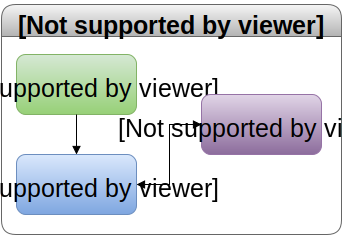
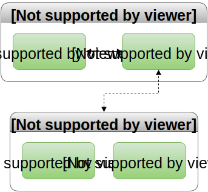
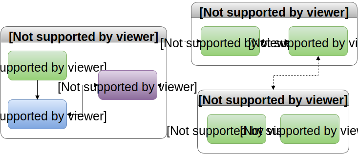
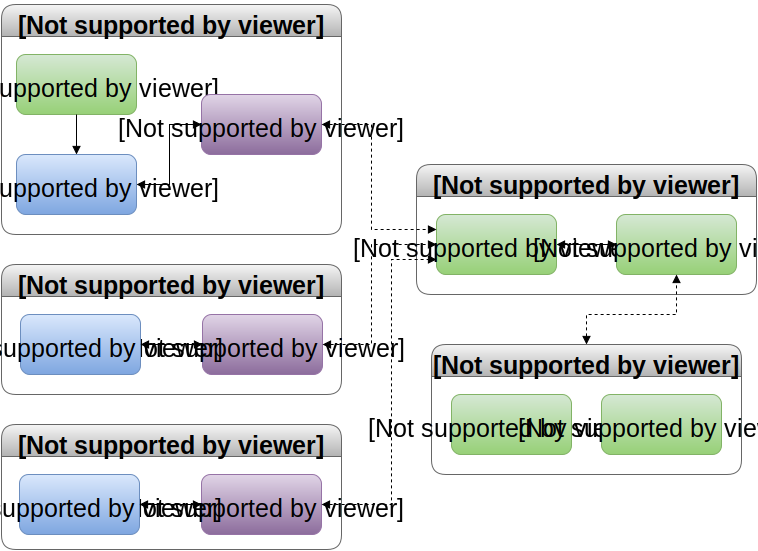

## Service Flow
### Key
 - Blue box: Client
 - Green box: Server
 - Purple box: Platform agnostic
 - Solid line: Inner-service communication
 - Dashed line: Cross-service communication

### Web Service

### API Service

### Web and API interaction

### Full Service
Note: Currently no planning around the mobile and desktop clients.  Focus on the web and API portion for the time being, but keep the future platforms in mind.

